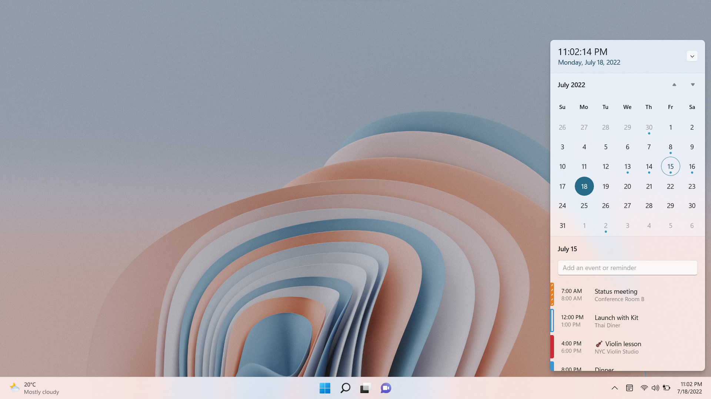

# Calendar Flyout

Welcome to the official issue-only repo for Calendar Flyout. Calendar Flyout is a desktop app that brings back agenda and clock with seconds to Windows 11. It primarily uses WPF and UWP (as XAML Islands).

⚡ Attention!  
Only Outlook personal calendars are synchronized properly. For other calendars (e.g., Google, Yahoo) you need to open Windows Calendar app to synchronize your appointments.

Microsoft Store: https://www.microsoft.com/store/apps/9P2B3PLJXH3V

  

Feel free to share ideas about new features or report bugs.